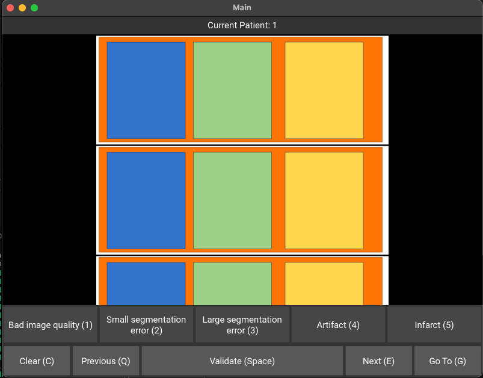

# Simple Image Grader

**Simple Image Grader** is a lightweight Python/Kivy application for reviewing and grading patient images. It provides a simple interface to toggle grading criteria, navigate between patients, and save results to an Excel file.

---



## Features

- Display patient images in a scrollable view.
- Grade images using 5 toggle buttons:
  1. Bad image quality
  2. Small segmentation error
  3. Large segmentation error
  4. Artifact
  5. Infarct
- Assess dominance using a toggle button (right by default, left if clicked)
- Toggle buttons provide color feedback:
  - Gray = not selected
  - Blue = selected manually
  - Green/Red = restored from Excel
- Keyboard shortcuts for fast navigation
- Automatic Excel file creation, read/write, and backup.
- Validation sound feedback when saving a patient.
- Popup support for "Go To Patient".

## Keyboard Shortcuts

- Q → Previous patient
- E → Next patient
- Space → Validate and save current patient
- C → Clear all grading toggles
- G → Go to a specific patient (opens popup)
- 1–5 → Toggle grading criteria:
  1. Bad image quality
  2. Small segmentation error
  3. Large segmentation error
  4. Artifact
  5. Infarct
- D → Toggle coronary dominance (Left / Right)
- M → Mute / unmute validation sound

---

## Installation

1. Clone the repository:

```bash
git clone https://github.com/gfahrni/Simple-Image-Grader.git
cd Simple-Image-Grader
```

2. Create a Python virtual environment (recommended):

```bash
python -m venv venv
source venv/bin/activate   # macOS/Linux
venv\Scripts\activate      # Windows
```

3. Install required packages:

```bash
pip install -r requirements.txt
```

---

## Usage

Run the app:

```bash
python main.py
```

- Ensure the `data/images/` folder exists with patient images named like `001_p1.png`, `001_p2.png`, etc.
- The first run will create a `results.xlsx` in `data/` to store grading results.
- Use toggle buttons or keyboard shortcuts to grade images.
- Press "Validate" (or Space) to save and move to the next patient.
- Backups of Excel data are automatically created if overwriting a patient row.

---

## Directory Structure

```
Simple-Image-Grader/
├── main.py
├── viewer.py
├── viewer.kv
├── excel_processor.py
├── images_processor.py
├── helpers/
│   ├── sounds.py
│   ├── paths.py
│   ├── icon_setup.py
│   ├── popups.py
│   ├── keyboard_handler.py
│   ├── toggle_helpers.py
├── assets/
│   ├── SimpleImageGrader.icns
│   ├── SimpleImageGrader.ico
│   ├── validate.wav
│   ├── screenshot_demo.png
├── data/
│   ├── results.xlsx
│   └── images/
│       └── *.png
├── requirements.txt
├── build_scripts/
│   ├── build_mac.py
│   ├── build_windows.py
├── LICENSE
└── README.md
```

---

## macOS Deployment

1. Install dependencies:

```bash
pip install kivy pyinstaller
```

2. Build the macOS app:

```bash
python build_scripts/build_mac.py
```

The `.app` bundle will be created in the `OUTPUT_FOLDER` specified in the build script.

---

## Windows Deployment

## Windows Deployment

1. Install dependencies:

```bash
pip install kivy pyinstaller
```

2. Build the Windows executable:

```python build_scripts/build_windows.py```

3. After building:

- The .exe will be located in dist_win/.
- keep the data/ folder next to the .exe (images, Excel results).
- The first run will create results.xlsx in data/ if it doesn’t exist.


---

## License

This project is licensed under the **MIT License** – see the [LICENSE](LICENSE) file for details.


